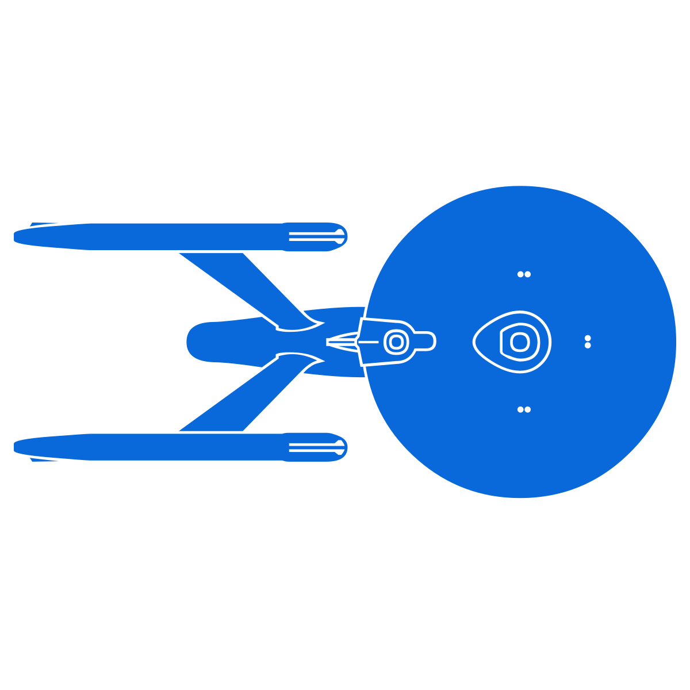

# Ember Polaris Pokedex

*A reference application to showcase what the [Ember Polaris](https://emberjs.com/editions/polaris/) edition looks like.*

## Technologies

The app is built using the latest bleeding-edge available for Ember apps:

- ⚡️ Vite-based Embroider
- 🔥 Volar-based Glint
- 💙 Native Ember TypeScript types from source
- 📦 Template-tag components ('.gjs', '.gts')
- 🚀 Warp Drive

It also embraces web standards by making use of:

- 🔗 View transition API
- 🎥 Scroll-driven animations

  
  
  
  
  
  
  
  
  

## Contributing

If you want to contribute to this project, please read [CONTRIBUTING.md](CONTRIBUTING.md).
